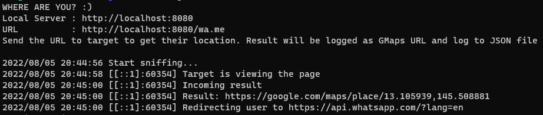

# GoSnifLocation

> Where are you, scammers? :)

Use this to track scammer location.

Please use it ethically.

## Drawbacks

Doing cat and mouse with scammers is tricky. Using this tool, we actually *scam* back the scammers. This tool requires location permission, we will ask scammer to grant the location. We won't be able to get their location if they are too aware.

## How to use

### Installation

1. Make sure you have install Go
2. Install [Ngrok](https://ngrok.com/download) for proxy the local server to public

### Development

1. Run `go run .` to start server
2. *Recommendation* You can fork this repo and customize your own

### Build & Run

1. Run `go build` and it will make a binary version `server`
2. Run `./server`, server will run with port `8080` by default
3. Run the Ngrok `ngrok http 8080`
4. Send Ngrok URL forwarding to target, it's recommended to mask the URL with URL shortener e.g. `https://<generated-id>.ap.ngrok.io/wa.me` -> `https://shorturl.at/<whatever>`
5. Turn off server after you get scammer location `CTRL+D` in the terminal

## Example 

**Logging**



**JSON File**

```json
{
  "geo_info": {
    "status": 0,
    "longitude": "13.105939",
    "latitude": "145.508881"
  },
  "ip_address": "[::1]:60316"
}
```

## Docs

### Endpoint

| Path       | Description                                |
|------------|--------------------------------------------|
| wa.me      | Inpersonate WA URL                         |
| redirect   | Redirection after we acquire location info |
| result     | API to send the coordinate to server       |

### GeoInfo Status

Based on [Error Code](https://developer.mozilla.org/en-US/docs/Web/API/GeolocationPositionError)

| Error Code | Description          |
|------------|----------------------|
| 0          | Success              |
| 1          | Permission denied    |
| 2          | Location unavailable |
| 3          | Timeout              |